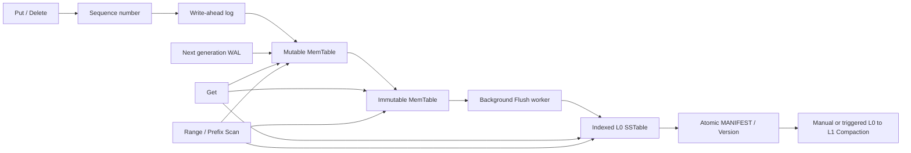

[English](DEVELOPMENT_DETAILS.md) | [中文](DEVELOPMENT_DETAILS_zh.md)

# MiniKV 开发细节

安装方式和最小使用示例请阅读[中文 README](README_zh.md)。

MiniKV 是一个面向 Linux、使用 C++17 编写的小型嵌入式 Key-Value
存储引擎。它采用 LSM 风格设计，重点展示明确的持久化语义、崩溃恢复、
不可变磁盘结构、严格的边界检查以及可复现的正确性和性能验证。

## 当前状态

V11 已完成既定开发路线，主要能力包括：

- 二进制安全的 Key 和 Value，并支持可配置大小上限；
- 单调递增 Sequence 和最大 Sequence 获胜语义；
- Delete 通过 tombstone 防止旧值重新出现；
- 带版本和 CRC32C 的 WAL，支持 strict 与 asynchronous write；
- 可以安全修复不完整的 WAL 最后一个记录；
- 一个 Mutable MemTable 和最多一个待处理 Immutable MemTable；
- 每个 generation 对应 WAL，Flush 后对应不可变 SSTable；
- 临时文件、文件同步、rename、目录同步构成的崩溃安全发布流程；
- 通过校验后的 `VersionEdit` 更新不可变 `Version` snapshot；
- 原子替换、带 CRC32C 的 MANIFEST，记录 live SSTable、level、Key 与
  Sequence 范围、下一个文件号和 Sequence frontier；
- Open 只信任 MANIFEST 引用，不通过扫描目录猜测 live file；
- 缺失引用文件或元数据不一致会作为 Corruption 拒绝；
- 自动清理未引用 SSTable 和中断遗留的临时文件；
- 明确的目录存储格式版本和 `VersionMismatch`；
- 基于非阻塞 `flock` 的进程生命周期 `LOCK` 文件；
- 按 Key 排序、按 block 组织、带 record/block checksum 的 SSTable；
- 保存每个 block 首 Key、offset 和 length 的 sparse index；
- 带 64 位区域 offset 和 Sequence 摘要的固定 Footer；
- 按预期 Key 数和目标误判率构造的 per-SSTable Bloom Filter；
- range-first、Bloom-second、sparse-index-last 的 point lookup；
- 每次操作和进程累计的精确读路径统计；
- 对磁盘输入派生的 offset、length、allocation 和 record 做完整检查；
- 删除已覆盖 WAL 前验证 SSTable 中的所有 block；
- 内存仅常驻 table metadata、sparse index 和 Bloom，不常驻 data record；
- Mutable、Immutable、L0、L1 之间按最大 Sequence 选择结果；
- 前台或自动 L0-to-L1 Compaction；
- 最小堆多路归并、重复版本折叠和安全 tombstone 清理；
- 可配置目标大小、Key 范围互不重叠的 L1 输出；
- 原子加入全部 Compaction 输出并删除全部输入的 `VersionEdit`；
- 全局字节序的范围扫描、前缀扫描和分页 continuation token；
- SSTable iterator 每次只读取一个经过验证的 block；
- 单写者、多读者并发模型和可选后台 Flush/Compaction；
- 后台错误可观测、可重试，Immutable slot 满时提供写者 backpressure；
- 幂等的 `Running -> Closing -> Closed` 生命周期；
- 数值稳定的 `StatusCode`、`StatusCodeName` 和错误分类谓词；
- 只读 `minikv_sstable_dump` 工具；
- 参考模型、真实 SIGKILL、故障注入、并发压力和格式变异测试；
- 固定种子的 Benchmark、延迟分位数及读写和空间放大指标；
- 语义软件版本 1.0.0，与所有磁盘格式版本独立；
- 标准 CMake install/export、`minikv::minikv` target 和 TGZ 包；
- 通过安装产物构建、关闭并重启数据库的独立 consumer 测试。

后台维护默认关闭，只有应用显式选择后才改变前台时序。MiniKV 当前只有
一个 Immutable generation、L0 和 Key 范围不重叠的 L1。它不提供 MVCC、
多 Key 事务、无锁维护、压缩或自动磁盘格式升级。遇到不支持的目录格式会
明确拒绝，迁移必须是单独的离线操作。

## 公共数据模型与操作语义

Key 和 Value 使用 `std::string` / `std::string_view` 表示任意字节序列，
不要求 UTF-8。Key 不能为空，默认最大 64 KiB；Value 可以为空，默认最大
4 MiB。`Put` 是 upsert；`Delete` 即使当前不存在可见值也会写入新 tombstone。
`Get` 通过 `Status` 区分 NotFound 与成功保存的空 Value。

`StatusCode` 的数值是稳定公共契约，已有值不能调整顺序：

| 数值 | 分类 |
| ---: | --- |
| 0 | Ok |
| 1 | NotFound |
| 2 | Incomplete |
| 3 | InvalidArgument |
| 4 | IOError |
| 5 | Corruption |
| 6 | VersionMismatch |
| 7 | Closed |

调用方应使用 `Status::code()`、`IsCorruption()` 等谓词或
`StatusCodeName()`，不应解析英文错误消息。

Scan 使用与 MemTable/SSTable 相同的字节序。范围是半开区间
`[begin,end)`；空 begin 表示无下界，缺省 end 表示无上界。Prefix Scan
在 prefix 内全局有序，空 prefix 是确定性的 load-all。每次 Scan 的 limit
必须为正且不超过 `Options::maximum_scan_entries`，默认最大 1,000。

Put/Delete、Version 发布和生命周期切换持有数据库独占锁；Get 和 Scan
持有共享锁，因此多个读者可以并行，每个调用在完整执行期间看到稳定状态。
维护发布会等待当前读者，读者不会看到切换一半的 Version。长 Scan 可能延迟
Version 发布，MiniKV 不承诺 MVCC 或跨多次调用的 range snapshot。

Continuation token 只有在逻辑和物理状态均未变化时才能跨重启继续使用。
成功的 Put/Delete 或改变 Version 的 Flush/Compaction 会使 token 过期。
正常 Close 可能 Flush 非空 Mutable，因此 Close 前创建的 token 也可能过期。

## WAL 格式版本 1

每条 WAL record 由固定 32 字节 Header 和 Key/Value payload 组成：

| Offset | Size | 字段 |
| ---: | ---: | --- |
| 0 | 4 | Magic `MKVW` |
| 4 | 1 | 格式版本 |
| 5 | 1 | Value 或 Delete record type |
| 6 | 2 | Header size |
| 8 | 4 | Record 总大小 |
| 12 | 8 | Sequence number |
| 20 | 4 | Key size |
| 24 | 4 | Value size |
| 28 | 4 | CRC32C |
| 32 | variable | Key bytes 后接 Value bytes |

所有整数使用 little-endian。Checksum 覆盖 Header `[0,28)` 和完整 payload。
Delete record 的 Value 必须为空。

## 写入、恢复与持久化语义

写入路径如下：

```text
校验输入
    -> 分配 Sequence
    -> 编码并完整 append 一条 WAL record
    -> strict 模式执行 fdatasync
    -> 更新 Mutable MemTable
```

strict 是默认模式。如果 append 或 `fdatasync` 失败，该操作不会进入
MemTable，后续写入也会被拒绝。asynchronous 模式跳过 `fdatasync`，进程
崩溃后可能丢失最近已经返回成功的写入。

恢复从 offset 0 开始扫描，要求 Sequence 全局递增，并在 replay 前验证每条
完整记录。只有“不完整的最后一条记录”可以修复：恢复会 truncate 到最后一个
已验证边界并执行 `fdatasync`。错误 Header、checksum 或 Sequence 顺序都是
硬 Corruption。Replay 具有事务性，失败时不会暴露部分 MemTable。

## MemTable generation 与 Flush

每个 generation 使用 20 位文件号。后台 Flush 的关键顺序是：

```text
00000000000000000001.wal
    -> Mutable generation 1 达到阈值
    -> 冻结为 Immutable generation 1
    -> 创建并目录同步 generation 2 WAL
    -> 返回已经提交的阈值写入
    -> worker 构造 00000000000000000001.sst.tmp
    -> fdatasync(table)
    -> rename 为正式 .sst
    -> fsync 数据库目录
    -> 重新打开并验证 SSTable
    -> 在内存应用 VersionEdit
    -> 写入并 fdatasync MANIFEST.tmp
    -> rename 为 MANIFEST
    -> fsync 数据库目录
    -> 发布新内存 Version
    -> 删除 generation 1 WAL
    -> fsync 数据库目录
```

旧 WAL 在 SSTable 已持久化、已验证并被持久 MANIFEST 引用前始终是恢复权威。
Flush 失败可在同一进程重试。崩溃后，如果旧 MANIFEST 仍有效，就 replay 保留
的 WAL 并删除未引用表；如果新 MANIFEST 已有效，就加载表并删除多余旧 WAL。
读者永远不会观察到只发布了一半的内存 Version。

启用 `Options::background_maintenance=true` 后，worker 在不持有数据库状态锁时
构造 SSTable，因此读者和下一 generation 写入可以继续；MANIFEST 发布仍需要
独占锁。如果下一 Mutable 达到阈值而 Immutable slot 仍被占用，写者在条件变量
上等待，直到 Flush 完成、Close 开始或后台错误出现。

MANIFEST Sequence frontier 只推进到当前发布 Immutable 的最大 Sequence，不会
提前声明仍只存在于下一 WAL 的更新。恢复只接受一个 active WAL，或表示一个
Immutable 加一个 Mutable 的两个连续 WAL；其他 gap 或未来 generation 都是
Corruption。

## 目录存储格式与 MANIFEST 版本 1

MANIFEST 是 live SSTable 集合的唯一权威，是完整不可变 Version snapshot。
`VersionEdit` 可以同时添加和删除文件，但发布通过原子替换完整 snapshot，
而不是 append 一个可能产生 torn tail 的日志记录。

固定 64 字节 Header：

| Offset | Size | 字段 |
| ---: | ---: | --- |
| 0 | 4 | Magic `MKMF` |
| 4 | 1 | MANIFEST format version `1` |
| 5 | 1 | Directory storage format version `2` |
| 6 | 2 | Header size `64` |
| 8 | 8 | 物理文件大小 |
| 16 | 8 | 单调递增 Version id |
| 24 | 8 | Next file number |
| 32 | 8 | Last published Sequence |
| 40 | 4 | Live table count |
| 44 | 4 | Table-record payload size |
| 48 | 8 | Reserved，必须为 0 |
| 56 | 4 | Header `[0,56)` 与完整 payload 的 CRC32C |
| 60 | 4 | Reserved，必须为 0 |

每个变长 table record：

```text
[record size:u32][level:u32][file number:u64][file size:u64]
[record count:u64][minimum sequence:u64][maximum sequence:u64]
[minimum key size:u32][maximum key size:u32][key bytes]
```

所有整数为 little-endian。任何 length/count 在控制 allocation 或 slice 前都要
验证；完整 MANIFEST 最大 64 MiB。Open 时，每张引用表必须存在、通过自身
checksum 并与 MANIFEST 摘要一致。未引用 SSTable 不参与任何读取。

## SSTable 格式版本 3

文件布局：

```text
[32-byte Header][Data Blocks][Sparse Index][Bloom Filter][104-byte Footer]
```

固定 Header：

| Offset | Size | 字段 |
| ---: | ---: | --- |
| 0 | 4 | Magic `MKST` |
| 4 | 1 | Format version `3` |
| 5 | 1 | Reserved |
| 6 | 2 | Header size |
| 8 | 8 | Generation |
| 16 | 8 | Record count |
| 24 | 4 | Data-block count |
| 28 | 4 | Header `[0,28)` 的 CRC32C |

每个 Data Block 有 20 字节 Header，后接按 Key 排序的 WAL-format record：

| Offset | Size | 字段 |
| ---: | ---: | --- |
| 0 | 4 | Magic `MKDB` |
| 4 | 4 | Block 总大小 |
| 8 | 4 | Record count |
| 12 | 4 | Payload size |
| 16 | 4 | Header `[0,16)` 与 payload 的 CRC32C |
| 20 | variable | 完整 WAL-format records |

Sparse Index 使用 20 字节 `MKIX` Header，包含总大小、entry count、payload
size 和 CRC32C。每个变长 entry：

```text
[key size:u32][absolute block offset:u64][block size:u32][first key bytes]
```

固定 104 字节 Footer 以 `MKSF` 开始，保存 format/Footer size、物理文件大小、
generation、record count、最小/最大 Sequence、data/index/Bloom 的 offset 与
size、block count，以及 Footer `[0,100)` 的 CRC32C。

Bloom 区域由固定 32 字节 Header 和 bit array 组成：

| Offset | Size | 字段 |
| ---: | ---: | --- |
| 0 | 4 | Magic `MKBF` |
| 4 | 1 | Bloom format version `1` |
| 5 | 1 | Hash position count |
| 6 | 2 | Header size `32` |
| 8 | 4 | Bloom 编码总大小 |
| 12 | 8 | Bit count |
| 20 | 8 | Inserted-key count |
| 28 | 4 | Header `[0,28)` 与 bit array 的 CRC32C |

预期 Key 数为 `n`、目标误判率为 `p` 时：

```text
m = ceil(-n * ln(p) / ln(2)^2)
k = round((m / n) * ln(2))
```

`m` 按字节对齐且至少 64 bit；`k` 限制在 `[1,30]`。两个稳定 64 位 hash
通过 double hashing 生成位置。序列化 Bloom 最大 64 MiB。

`SSTableReader::Open` 验证 Bloom checksum，并在检查 data block 时验证每个
真实 Key 都可能被 Bloom 命中，因此 Bloom false negative 会作为硬 Corruption。
`Options::bloom_filter_enabled` 可用于对照实验，默认目标误判率为 1%。

Open 先读取固定 Header/Footer，证明所有区域连续且位于物理文件内部，加载并
验证 sparse index 和 Bloom，再流式检查每个 block 及摘要，不保留 data record。
Get 依次检查 table Key range、Bloom、sparse index，使用 `pread` 读取一个候选
block，重新验证并二分记录。I/O error 和 Corruption 不会转换为 NotFound。

## 读统计与 Bloom 实验

`Database::Get(key, &operation_stats)` 返回单次 lookup 的统计；
`Database::read_statistics()` 返回进程 Open 以来的累计统计。Block、table 和
byte 计数是精确值；Bloom 配置和测得的误判率是统计值。只有 Bloom 返回
“may contain”而验证后的候选 block 不含 Key 时，才记为 false positive。

确定性测试向目标 1% 的 Bloom 插入 10,000 个 Key，再检查 100,000 个不存在
的 Key，固定结果是 986 次误判，即 0.986%。另一个 5,000 次 SSTable 查询的
fixture 中，Bloom 开启读取 54 个 data block，关闭读取 4,999 个。

```bash
./build/minikv_bloom_filter_test
```

时间会受文件系统缓存、机器负载和构建模式影响，因此这些测试时间只能作为
说明，不能当作跨机器 Benchmark。

## L0-to-L1 Compaction

`Database::Compact` 先 Flush 待处理 Mutable，再选择全部 L0。L0 Key range
并集决定需要选择哪些相交 L1，端点相等也视为相交。只有覆盖完整 bottommost
range，才可以安全删除获胜 tombstone，因为未选择的更低层中不存在旧值。

每个输入已经按 Key 排序。最小堆归并所有输入，相同 user Key 由最大 Sequence
获胜。输出按 `Options::compaction_output_size_limit` 切分，默认约 2 MiB record
data；所有 L1 range 必须严格不重叠。

发布顺序：

```text
编码全部输出
    -> 写入并 fdatasync 全部 .sst.tmp
    -> rename 全部正式 SSTable
    -> fsync 数据库目录
    -> 重新打开并验证全部输出
    -> 构造一个 VersionEdit：加入输出 + 删除输入
    -> 写入、fdatasync、rename 并目录同步 MANIFEST
    -> 发布新内存 Version
    -> 释放旧输入 reader
    -> 删除输入 SSTable 和过期空 WAL
    -> fsync 数据库目录
```

MANIFEST 发布前旧 Version 是权威，新输出只是无害 orphan；发布后新 Version
是权威，旧输入只是无害 orphan。启动会删除未引用集合，每一步都可以重试。

```cpp
minikv::CompactionStats stats;
const minikv::Status status = database->Compact(&stats);
if (status.ok()) {
    // stats.input_bytes, stats.output_bytes, stats.bytes_reclaimed, ...
}
```

```bash
./build/minikv_compaction_test
```

Compaction 测试覆盖跨 generation 重复 Key、Put-Delete-Put、全 tombstone 输出、
不相交与端点相等 range、输出切分、参考模型、12 个发布/清理故障，以及六个
真实 SIGKILL commit boundary。

## 范围扫描与前缀扫描

`Database::Scan` 为每个 live source 建立一个有序 cursor。SSTable cursor 通过
sparse index seek 到 begin 附近，并且一次只保留一个已验证 block。最小堆选择
下一个 user Key；重复 Key 由最大 Sequence 获胜，获胜 tombstone 隐藏该 Key。
Bloom 不用于范围遍历。

```cpp
minikv::ScanOptions options;
options.begin = "build:";
options.end = "build;";  // Exclusive.
options.limit = 100;

minikv::ScanResult page = database->Scan(options);
if (page.status.ok() && page.truncated) {
    options.continuation_token = page.continuation_token;
    minikv::ScanResult next_page = database->Scan(options);
}

minikv::ScanResult prefix_page = database->ScanPrefix("build:", 100);
minikv::ScanResult all_page = database->LoadAll(100);
```

Continuation token 是不透明二进制字符串，包含格式/长度、规范化 range、最后
返回 Key、Version id、Sequence frontier 和 CRC32C。文本协议可将其编码为
base64。只有 `truncated=true` 时才返回 token，恢复严格从最后 Key 之后开始，
因此状态不变时分页不会重复。

```bash
./build/minikv_range_scan_test
```

测试覆盖 sparse-index seek、多 block iterator、二进制边界、全 `0xff` prefix、
全部内存/磁盘 source、失败 Flush 后 Immutable 可见性、严格 limit、改变 page
size、重启续扫、逐字节 token 变异、过期 token、参考模型、维护和 Open 后
SSTable 损坏。

## 后台维护、并发与 Close

后台维护需要显式开启，每个 Open Database 使用一个 worker：

```cpp
minikv::Options options;
options.background_maintenance = true;
options.level0_compaction_trigger = 4;

std::unique_ptr<minikv::Database> database;
minikv::DatabaseOpenResult opened;
minikv::Status status = minikv::Database::Open(
    "./data", options, &database, &opened
);
if (status.ok()) {
    status = database->Put("key", "value");
}
if (status.ok()) {
    status = database->WaitForBackgroundWork();
}
const auto maintenance = database->background_statistics();
const minikv::Status close_status = database->Close();
```

Get、Scan 和只读观察者共享持有 state lock；Put/Delete、前台维护、Version
发布和 Close 独占持有。读统计 mutex 只能在 state lock 后取得，且不会反向
获取 state lock。Worker 构造和发布 table 文件时释放状态锁，在发布 MANIFEST
与切换 Version 前重新取得独占锁。

阈值 Put/Delete 返回 WAL commit 结果，而不是未来 worker 结果。后台错误通过
`WaitForBackgroundWork()` 与 `background_status()` 返回，并增加 failure 统计；
前台 `Flush()` 可以重试。如果下一 Mutable 达到上限，写入等待而不会创建无界
Immutable queue。后台错误会暂停新写，直到前台 Flush/Compact 重试成功。

Close 在独占锁下先切换为 Closing，让已有读者结束并阻止新操作；随后唤醒阻塞
写者、停止并 join worker、重试待处理 Immutable Flush、Flush 非空 Mutable、
释放进程锁并切换 Closed。Close 不要求 Compaction。重复或并发 Close 返回第一
次结果。即使 Close 失败也会释放资源，保留 WAL 在下次 Open 时仍是恢复权威。
析构函数会调用 Close，但无法返回错误，因此需要错误处理的调用方应显式 Close。

```bash
./build/minikv_concurrency_test
./build/minikv_reliability_test
./build/minikv_format_fuzz_test
```

并发测试覆盖下一 generation 进展、两个连续 WAL 崩溃恢复、后台错误重试、自动
Compaction、失败 Close 恢复、四读者/一写者和并发 Close。可靠性测试使用固定
种子的 20,000 操作 `std::map` 参考模型、八轮严格写 SIGKILL、有界多读多写和
同 Key Sequence 顺序。Format-fuzz 使用 30,000 个任意输入、12,000 个合法语料
变异和 750 个真实 SSTable 变异；它是确定性变异测试，不是 coverage-guided fuzz。

## 可复现 Benchmark

使用 Release 构建，并运行单个 workload 或固定矩阵：

```bash
cmake -S . -B build-release -DCMAKE_BUILD_TYPE=Release
cmake --build build-release --parallel

./build-release/minikv_benchmark \
  --workload read-miss --operations 5000 --keys 5000 --bloom on

./bench/run_matrix.sh ./build-release/minikv_benchmark \
  benchmark-results/matrix > benchmark-results/matrix.jsonl
```

每个 workload 使用固定默认种子，默认验证最终逻辑值，拥有独立临时数据库并在
结束时删除。矩阵覆盖顺序/随机 asynchronous write、hit/miss read、Bloom
on/off、Compact 前后、50/50 与 95/5 混合负载、四读者并行读和较小 strict write。
每次结果是一行 JSON，便于保存和比较。

指标边界：

- `ops_per_second` 和 P50/P95/P99 只覆盖用户操作；
- `end_to_end_ops_per_second` 还包含写负载末尾 Flush；
- `maintenance_us` 单独记录末尾维护时间；
- blocks/tables/bytes per read 来自引擎精确计数器；
- 估算写放大为 `(encoded WAL bytes + SSTable bytes) / logical Key/Value
  bytes`，只对纯写负载输出，不包含 MANIFEST 重写、文件系统元数据或设备内部写；
- 空间放大为当前 SSTable、WAL、MANIFEST 字节除以当前逻辑 Key/Value 字节。

一次本地 Release 结果如下，仅描述该次运行，不代表其他硬件或 RocksDB：

| Workload / 配置 | End-to-end ops/s | P50 us | Data blocks/read |
| --- | ---: | ---: | ---: |
| Sequential write，async | 66,193 | 2.900 | 0 |
| Sequential write，strict | 2,406 | 368.502 | 0 |
| Read hit，Bloom on，16 L0 | 10,385 | 80.570 | 1.155 |
| Read miss，Bloom on，16 L0 | 66,838 | 1.615 | 0.156 |
| Read miss，Bloom off，16 L0 | 811 | 1,202.891 | 15.788 |
| Read miss，Bloom on，Compacted | 859,096 | 0.220 | 0.011 |
| Parallel read hit，四线程 | 36,364 | 78.404 | 1.156 |

一次优化闭环将两个 seeded FNV 状态改为在同一次 Key 遍历中更新，同时保留旧版
unsigned hash 运算、finalizer 和 double-hash position。Golden format 和 Bloom
测试仍为 986/100,000 false positive，固定 32 table miss 仍是 0.326 block 和
1,311.253 byte/read。五轮 100,000 操作的新旧中位吞吐分别为 31,879 与 31,893
ops/s，0.05% 差异属于机器噪声，因此不宣称端到端加速。

当前虚拟机 `perf_event_paranoid=4`，无法取得 Linux `perf` counter。项目不会
修改宿主安全策略来制造 profile。

## 构建与测试

要求 Linux、CMake 3.16+ 和 C++17 compiler：

```bash
cmake -S . -B build -DCMAKE_BUILD_TYPE=Debug
cmake --build build --parallel
ctest --test-dir build --output-on-failure
```

Memory sanitizer 配置必须使用独立目录：

```bash
cmake -S . -B build-asan -DCMAKE_BUILD_TYPE=Debug -DMINIKV_ENABLE_ASAN=ON
cmake --build build-asan --parallel
ctest --test-dir build-asan --output-on-failure

cmake -S . -B build-ubsan -DCMAKE_BUILD_TYPE=Debug -DMINIKV_ENABLE_UBSAN=ON
cmake --build build-ubsan --parallel
ctest --test-dir build-ubsan --output-on-failure
```

TSan 已配置但必须单独构建。部分虚拟化 Linux 无法初始化 shadow-memory mapping；
这种平台失败不能报告为 race check 通过。

## 安装与外部使用

```bash
cmake -S . -B build-release -DCMAKE_BUILD_TYPE=Release
cmake --build build-release --parallel
cmake --install build-release --prefix "$PWD/minikv-prefix"
cpack --config build-release/CPackConfig.cmake -G TGZ
```

`vMAJOR.MINOR.PATCH` 格式的 Tag 会触发专用 Release workflow。Workflow 固定
使用 Ubuntu 22.04 和 x86-64 runner，验证 Tag 与 CMake 项目版本一致，运行完整
测试，生成 TGZ，再使用解压后的安装包构建并运行外部 consumer。以上步骤全部
通过后，才会将安装包与 `SHA256SUMS` 发布至 GitHub Releases。

无需克隆仓库即可下载 v1.0.0 binary SDK：

```bash
curl -LO https://github.com/tdkjsmr/MiniKV-Storage-Engine/releases/download/v1.0.0/minikv-1.0.0-linux-x86_64.tar.gz
curl -LO https://github.com/tdkjsmr/MiniKV-Storage-Engine/releases/download/v1.0.0/SHA256SUMS
sha256sum --check SHA256SUMS
tar -xzf minikv-1.0.0-linux-x86_64.tar.gz
```

该 SDK 提供 C++ 静态库，并不是无需开发环境的通用独立应用。Consumer 仍需
C++17 compiler 和 CMake；预编译 object 与工具需要兼容 Ubuntu 22.04 构建
基线的 Linux、glibc 和 libstdc++ 环境。

外部 CMake 项目只使用安装产物：

```cmake
find_package(MiniKV 1.0 CONFIG REQUIRED)
add_executable(my_store main.cpp)
target_link_libraries(my_store PRIVATE minikv::minikv)
target_compile_features(my_store PRIVATE cxx_std_17)
```

```bash
cmake -S /path/to/my_store -B /path/to/my_store/build \
  -DCMAKE_PREFIX_PATH=/absolute/path/to/minikv-prefix
cmake --build /path/to/my_store/build --parallel
```

非 sanitizer 的普通 `ctest` 包含 `install_smoke`：它安装 MiniKV 到干净 prefix，
通过 `find_package` 配置独立 consumer，链接 `minikv::minikv`，完成 Put/Get、
Close、reopen 和持久值验证。Release 专用的 `package_smoke.cmake` 对解压后的
TGZ 重复这一契约。两个 consumer 都不接收源码树 include/library path。

MiniKV 1.0.0 是软件包语义版本。WAL、MANIFEST、SSTable、Bloom、continuation
token 和 directory-storage version 是互相独立的兼容性契约。

## 架构



## V0–V11 路线图

1. V0：内存语义、Sequence、tombstone 和模型测试。
2. V1：带版本 WAL、完整写、checksum 和同步策略。
3. V2：WAL replay、尾部修复、损坏检测和崩溃测试。
4. V3：MemTable generation、per-generation WAL 和安全 Flush。
5. V4：block SSTable、sparse index、checksum 和磁盘 point lookup。
6. V5：MANIFEST、原子 Version 发布、storage identity 和目录锁。
7. V6：Bloom Filter 与读路径统计。
8. V7：保持语义的 L0-to-L1 Compaction。
9. V8：有界确定性范围/前缀扫描和 continuation token。
10. V9：后台 Flush/Compaction、单写多读协调、稳定 Scan 和幂等关闭。
11. V10：参考模型、故障、崩溃、格式兼容、fuzz 和并发压力验证。
12. V11：可复现 workload、延迟分位数、放大指标、优化闭环和安装/API 稳定化。

以上版本均已完成，并通过最终汇总 PR 合入 main。

## 核心不变量

- 每个已接受 record 都有非零 Sequence；
- 相同 user Key 始终由最大 Sequence 获胜；
- tombstone 在能够安全删除前保持内部可见；
- storage error 和 Corruption 绝不转换为 NotFound；
- 所有磁盘派生 offset/length 在使用前验证；
- 只有有效、持久且被持久 MANIFEST 引用的 table 才能覆盖 generation WAL；
- 每个 MANIFEST 引用必须对应存在、已验证且 metadata 匹配的文件；
- 不在当前 Version 的文件永不参与读取；
- 同一数据库目录最多只有一个进程持有独占 `LOCK`；
- 后台 Flush 只发布其 Immutable generation 的 Sequence frontier；
- Closing 拒绝新工作、join worker，并让未 Flush 的 committed record 保持可恢复。

## 项目边界

MiniKV 是单机嵌入式引擎。范围不包括 SQL、网络协议、分布式共识、复制、
多 Key 事务、MVCC、压缩、加密或 RocksDB 格式兼容。Benchmark 只描述 MiniKV，
不宣称生产级对比。

## 仓库结构

```text
.
├── CMakeLists.txt
├── bench/
├── cmake/
├── include/minikv/
├── src/
├── tests/
└── tools/
```
