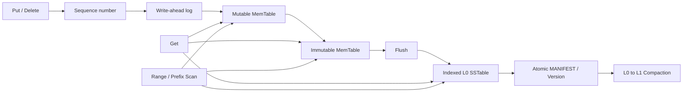

# MiniKV Storage Engine

MiniKV is a small embedded key-value storage engine written in C++17 for
Linux. Its LSM-style design emphasizes explicit durability semantics, crash
recovery, immutable on-disk structures, boundary-checked parsing, and
reproducible correctness tests.

## Current status

V8 adds bounded deterministic range and prefix scans on top of the V7
two-level compaction engine:

- binary-safe keys and values with configurable size limits;
- monotonically increasing sequence numbers and last-write-wins semantics;
- tombstones that prevent values in older generations from reappearing;
- versioned, CRC32C-protected WAL records and strict or asynchronous writes;
- recovery with safe repair of an incomplete final WAL record;
- one active Mutable MemTable and at most one pending Immutable MemTable;
- one WAL and, after Flush, one immutable SSTable per generation;
- crash-safe publication ordered as temporary write, file sync, rename, and
  directory sync;
- immutable `Version` snapshots changed through validated `VersionEdit`s;
- an atomically replaced, CRC32C-protected MANIFEST that records the live
  SSTable set, levels, key and sequence bounds, next file number, and sequence
  frontier;
- startup driven only by MANIFEST references rather than inferred directory
  contents;
- rejection of missing referenced files and metadata disagreements as hard
  corruption;
- cleanup of unreferenced SSTables and interrupted temporary files;
- an explicit directory storage-format version and `VersionMismatch` status
  for unsupported or pre-MANIFEST directories;
- a process-lifetime `LOCK` file acquired with non-blocking `flock`, preventing
  two engine instances from mutating the same directory;
- block-oriented, key-sorted SSTables with per-record and per-block checksums;
- a sparse index containing each data block's first key, offset, and length;
- a fixed-size Footer with 64-bit region offsets and sequence summaries;
- per-SSTable Bloom filters sized from the expected key count and a configurable
  target false-positive rate (1% by default);
- range-first, Bloom-second, sparse-index-last point lookup, so a definite
  Bloom miss performs no data-block read;
- per-operation and lifetime-cumulative read statistics for MemTable hits,
  tables considered, range and Bloom rejections, Bloom false positives, data
  blocks read, and bytes read;
- complete boundary checks and a 64 MiB index-memory cap before every offset,
  length, allocation, and record
  parse derived from disk bytes;
- startup validation of every SSTable block before its covered WAL may be
  removed;
- memory-resident table metadata and sparse indexes, while point reads fetch
  only one candidate data block from disk;
- key-range rejection without a data-block read;
- reads across Mutable, Immutable, and multiple SSTables, with the greatest
  sequence number winning and tombstones converted to user-visible NotFound;
- manual foreground compaction of every L0 file plus all L1 files overlapping
  the selected key-range union;
- minimum-heap multiway merge with greatest-sequence-wins duplicate collapse;
- safe tombstone removal after selecting the complete bottommost range, with
  deletion-only compactions allowed to produce no SSTable;
- key-sorted L1 outputs split at a configurable approximate data-size target,
  with validated non-overlapping L1 ranges;
- one atomic `VersionEdit` that adds every compaction output and deletes every
  input, followed by input-file removal only after old readers are released;
- per-compaction input/output file, record, byte, duplicate, tombstone,
  elapsed-time, and reclaimed-byte statistics;
- bytewise globally ordered `Scan([begin,end))` and `ScanPrefix` across
  Mutable, Immutable, L0, and L1 sources;
- one-block-at-a-time SSTable iterators that seek through the sparse index;
- strict configurable result limits, explicit truncation, and opaque
  CRC32C-protected continuation tokens bound to their range and database state;
- scan statistics for sources and tables considered, data blocks and bytes
  read, records examined, obsolete versions collapsed, and tombstones hidden;
- a read-only `minikv_sstable_dump` diagnostic utility;
- deterministic random-model tests, exhaustive one-byte SSTable and MANIFEST
  corruption, per-stage Flush and Compaction publication failures, real
  SIGKILL commit-boundary tests, lock-conflict tests, restart tests, and
  sanitizer build options.

V8 still uses foreground Flush and manual foreground Compaction. It supports
only L0 and non-overlapping L1, not a general multi-level compaction policy. It
does not yet have background work, in-process concurrent calls, compression,
or an automatic storage-format upgrade path. Statistics are not yet
concurrency-safe. Unsupported directory formats are rejected; migration must
be an explicit offline operation.

## Public data model and operation semantics

Keys and values are arbitrary byte strings represented by `std::string` and
`std::string_view`; they are not required to be UTF-8. Keys are non-empty and
default to a 64 KiB maximum. Values may be empty and default to a 4 MiB
maximum. `Put` is an upsert. `Delete` writes a new tombstone and succeeds even
when no visible value currently exists. `Get` distinguishes NotFound from a
successfully stored empty value through `Status`.

Scan ordering is the same bytewise lexicographic ordering used by MemTable and
SSTable records. Range scans use the half-open interval `[begin,end)`; an empty
begin is unbounded below and an absent end is unbounded above. Prefix scans are
globally ordered within the prefix, and an empty prefix is the deterministic
load-all operation. Every scan has a positive limit no greater than
`Options::maximum_scan_entries`, which defaults to 1,000.

V8 remains single-threaded. One scan call observes the Database state at that
call. A continuation token can be reused after restart while the logical state
is unchanged, but any successful Put/Delete or Version-changing Flush/
Compaction makes it explicitly stale. V9 will introduce synchronization and
stable views for concurrent calls; V8 does not claim a cross-mutation snapshot.

## WAL format version 1

Each WAL record has a fixed 32-byte header followed by the key and value:

| Offset | Size | Field |
| ---: | ---: | --- |
| 0 | 4 | Magic bytes `MKVW` |
| 4 | 1 | Format version |
| 5 | 1 | Record type: value or deletion |
| 6 | 2 | Header size |
| 8 | 4 | Total record size |
| 12 | 8 | Sequence number |
| 20 | 4 | Key size |
| 24 | 4 | Value size |
| 28 | 4 | CRC32C |
| 32 | variable | Key bytes followed by value bytes |

All integers are little-endian. The checksum covers header bytes `[0, 28)`
and the complete payload. A deletion record must have an empty value.

## Write, recovery, and durability semantics

The write path is:

```text
validate input
    -> allocate a sequence number
    -> encode and completely append one WAL record
    -> fdatasync in strict mode
    -> update the Mutable MemTable
```

Strict mode is the default. If append or `fdatasync` fails, the operation is not
made visible in the MemTable and the writer rejects later writes. Asynchronous
mode skips `fdatasync` and may lose recently acknowledged writes after a crash.

Recovery scans from byte zero, requires globally increasing sequence numbers,
and verifies every complete record before replay. Only an incomplete final
record is repairable: recovery truncates to the last verified boundary and
calls `fdatasync`. Bad headers, checksums, or sequence order are hard
corruption. Replay is transactional, so failed recovery exposes no partial
MemTable.

## MemTable generations and Flush

Each generation uses a 20-digit file number:

```text
00000000000000000001.wal
    -> Mutable generation 1 reaches its byte limit
    -> Immutable generation 1
    -> 00000000000000000001.sst.tmp
    -> fdatasync(table)
    -> rename to 00000000000000000001.sst
    -> fsync(database directory)
    -> validate the published SSTable
    -> apply one VersionEdit in memory
    -> write MANIFEST.tmp and fdatasync it
    -> rename MANIFEST.tmp to MANIFEST
    -> fsync(database directory)
    -> publish the new in-memory Version
    -> remove generation 1 WAL
    -> fsync(database directory)
    -> open generation 2 WAL
```

The old WAL remains authoritative until the table is durable, validated, and
referenced by a durable MANIFEST. Failed Flush work can be retried in process.
After a crash, the old MANIFEST means the retained WAL is replayed and an
unreferenced table is removed; the new MANIFEST means the table is loaded and
the redundant old WAL is removed. A half-published in-memory Version is never
observable.

An automatic Flush happens after the threshold-crossing write has completed
its WAL and MemTable steps. If maintenance then fails, that record remains
readable and recoverable even though the call reports an I/O error.

## Directory storage format and MANIFEST version 1

The MANIFEST is the sole authority for the set of live SSTables. It is a full
immutable Version snapshot. A `VersionEdit` may add and delete files together,
but publication replaces the snapshot atomically instead of appending a record
that could leave a torn tail.

The fixed 64-byte header is:

| Offset | Size | Field |
| ---: | ---: | --- |
| 0 | 4 | Magic `MKMF` |
| 4 | 1 | MANIFEST format version `1` |
| 5 | 1 | Directory storage format version `2` |
| 6 | 2 | Header size `64` |
| 8 | 8 | Physical file size |
| 16 | 8 | Monotonic Version id |
| 24 | 8 | Next file number |
| 32 | 8 | Last published sequence number |
| 40 | 4 | Live-table count |
| 44 | 4 | Table-record payload size |
| 48 | 8 | Reserved, must be zero |
| 56 | 4 | CRC32C of bytes `[0, 56)` and the complete payload |
| 60 | 4 | Reserved, must be zero |

Each variable table record contains:

```text
[record size: u32][level: u32][file number: u64][file size: u64]
[record count: u64][minimum sequence: u64][maximum sequence: u64]
[minimum key size: u32][maximum key size: u32][key bytes]
```

All integers are little-endian. Every length and count is validated before it
controls allocation or slicing. The complete MANIFEST is capped at 64 MiB.
On `Open`, every referenced table must exist, pass its own checksums, and agree
with the MANIFEST summaries. Unreferenced SSTables never participate in reads.

## SSTable format version 3

The file layout is:

```text
[32-byte Header][Data Blocks][Sparse Index][Bloom Filter][104-byte Footer]
```

The fixed Header is:

| Offset | Size | Field |
| ---: | ---: | --- |
| 0 | 4 | Magic `MKST` |
| 4 | 1 | Format version `3` |
| 5 | 1 | Reserved |
| 6 | 2 | Header size |
| 8 | 8 | Generation |
| 16 | 8 | Record count |
| 24 | 4 | Data-block count |
| 28 | 4 | CRC32C of bytes `[0, 28)` |

Each data block has a 20-byte header followed by key-sorted WAL-format records:

| Offset | Size | Field |
| ---: | ---: | --- |
| 0 | 4 | Magic `MKDB` |
| 4 | 4 | Total block size |
| 8 | 4 | Record count |
| 12 | 4 | Payload size |
| 16 | 4 | CRC32C of bytes `[0, 16)` and the payload |
| 20 | variable | Complete WAL-format records |

The sparse index has a 20-byte `MKIX` header containing total size, entry count,
payload size, and CRC32C. Every variable entry is:

```text
[key size: u32][absolute block offset: u64][block size: u32][first key bytes]
```

The fixed 104-byte Footer begins with `MKSF` and stores format and Footer sizes,
physical file size, generation, record count, minimum and maximum sequence,
data offset and size, index offset and size, Bloom offset and size, block count,
and a CRC32C over Footer bytes `[0, 100)`.

The Bloom region starts with this fixed 32-byte header and is followed by its
bit array:

| Offset | Size | Field |
| ---: | ---: | --- |
| 0 | 4 | Magic `MKBF` |
| 4 | 1 | Bloom format version `1` |
| 5 | 1 | Hash-position count |
| 6 | 2 | Header size `32` |
| 8 | 4 | Total encoded Bloom size |
| 12 | 8 | Bit count |
| 20 | 8 | Inserted-key count |
| 28 | 4 | CRC32C of bytes `[0, 28)` and the complete bit array |

For expected key count `n` and target false-positive probability `p`, MiniKV
uses `m = ceil(-n * ln(p) / ln(2)^2)` bits (byte-aligned, at least 64 bits) and
`k = round((m / n) * ln(2))` hash positions, clamped to `[1, 30]`. Two stable
64-bit hashes generate the `k` positions by double hashing. The serialized
region is capped at 64 MiB.

`SSTableReader::Open` validates the Bloom checksum and verifies every stored
key against the decoded filter while it validates data blocks. This makes a
false negative hard corruption even if an attacker also recomputes the Bloom
checksum. `Options::bloom_filter_enabled` can disable filter construction and
lookup for controlled comparisons; `bloom_false_positive_rate` defaults to
`0.01`.

`SSTableReader::Open` first reads the fixed Header and Footer, proves that all
regions are contiguous and inside the physical file, validates and loads the
sparse index and Bloom filter, and then streams through every block once for
integrity and summary verification. It retains no data records. `Get` checks
the table key range, then Bloom, binary-searches the sparse index, `pread`s one
candidate block, revalidates it, and binary-searches its decoded records. I/O
errors and corruption are never converted into NotFound.

## Read statistics and Bloom experiment

`Database::Get(key, &operation_stats)` returns counters for that one lookup.
`Database::read_statistics()` returns counters accumulated since the current
process opened the database. These are exact counters, not estimates; Bloom's
configured and measured false-positive probabilities are statistical values.
A Bloom false positive is counted only when Bloom says "may contain" and the
verified candidate block does not contain the key.

The deterministic Debug test inserts 10,000 keys into a filter targeting 1%
and checks 100,000 distinct absent keys. The current stable-hash fixture
observes 986 false positives (0.986%). A separate 5,000-query SSTable fixture
(4,999 keys are in range) reads 54 data blocks with Bloom enabled and 4,999
with it disabled.
One local Debug run measured 2,652 microseconds versus 60,880 microseconds.
Those timings are illustrative rather than a benchmark: filesystem cache,
machine load, and build mode affect them. Reproduce both experiments with:

```bash
./build/minikv_bloom_filter_test
```

## L0-to-L1 compaction

`Database::Compact` first flushes pending mutable data, then selects all L0
tables. Their minimum-to-maximum key union determines which L1 tables overlap;
endpoint equality counts as overlap. Selecting the complete overlapping range
is what makes it safe in this two-level engine to remove a winning tombstone:
there is no unselected older value for that key below L1. A future engine with
deeper levels would have to retain the tombstone unless it proved those levels
also contain no older value.

Each input is already key-sorted. A minimum heap merges the current record from
every input, and the greatest Sequence wins for equal user keys. Output is
split using `Options::compaction_output_size_limit`, which defaults to 2 MiB of
approximate record data. L1 ranges are validated as strictly non-overlapping.

Publication uses this order:

```text
encode every output
    -> write and fdatasync every .sst.tmp
    -> rename every output SSTable
    -> fsync database directory
    -> reopen and validate every output
    -> build one VersionEdit: add outputs + delete inputs
    -> write, fdatasync, rename, and directory-sync MANIFEST
    -> publish the new in-memory Version
    -> release old input readers
    -> remove input SSTables and obsolete empty WAL
    -> fsync database directory
```

Before MANIFEST publication, the old Version remains authoritative and output
files are harmless orphans. After publication, the new Version is authoritative
and old inputs are harmless orphans. Startup removes whichever set is not
referenced. Every step is retryable in process.

```cpp
minikv::CompactionStats stats;
const minikv::Status status = database->Compact(&stats);
if (status.ok()) {
    // stats.input_bytes, stats.output_bytes, stats.bytes_reclaimed, ...
}
```

The V7 suite covers duplicate keys across generations, Put-Delete-Put,
Put-Delete, all-tombstone output, disjoint and equal-boundary ranges, output
splitting, a deterministic reference model before/after/restart, 12 injected
publication/cleanup failures, and six real SIGKILL commit boundaries. Run it
directly with:

```bash
./build/minikv_compaction_test
```

## Range and prefix scans

`Database::Scan` merges one ordered cursor per live source. Mutable and
Immutable MemTables are bounded by their configured size. Every SSTable cursor
uses its sparse index to seek near `begin` and retains one verified data block
at a time. A minimum heap chooses the next User Key; for duplicate keys, the
greatest Sequence wins, and a winning tombstone suppresses the key. Bloom
filters are intentionally not used for range traversal.

```cpp
minikv::ScanOptions options;
options.begin = "build:";
options.end = "build;";  // Exclusive.
options.limit = 100;

minikv::ScanResult page = database->Scan(options);
if (page.status.ok() && page.truncated) {
    options.continuation_token = page.continuation_token;
    minikv::ScanResult next_page = database->Scan(options);
}

minikv::ScanResult prefix_page = database->ScanPrefix("build:", 100);
minikv::ScanResult all_page = database->LoadAll(100);
```

The continuation token is an opaque binary string. It contains format and
length fields, the canonical range, the last returned key, Version id and
Sequence frontier, plus a CRC32C. Callers should store or transport it as an
opaque value; a text protocol can encode it as base64. A token is returned only
when `truncated` is true, and resumption is strictly after the last returned
key, preventing duplicates between unchanged pages.

The V8 suite covers sparse-index seeks, multi-block iteration, binary bounds,
all-`0xff` prefixes, every in-memory/on-disk source, failed-Flush Immutable
visibility, strict limits, changed page sizes, restart continuation, every
single-byte token mutation and truncation, stale tokens, a 500-operation model,
Flush/Compaction, restart, and post-Open SSTable corruption. Run it directly:

```bash
./build/minikv_range_scan_test
```

## Build and test

Requirements:

- Linux
- CMake 3.16 or newer
- a C++17 compiler such as GCC 9 or newer

```bash
cmake -S . -B build -DCMAKE_BUILD_TYPE=Debug
cmake --build build --parallel
ctest --test-dir build --output-on-failure
```

Run the memory-safety configurations separately:

```bash
cmake -S . -B build-asan -DCMAKE_BUILD_TYPE=Debug -DMINIKV_ENABLE_ASAN=ON
cmake --build build-asan --parallel
ctest --test-dir build-asan --output-on-failure

cmake -S . -B build-ubsan -DCMAKE_BUILD_TYPE=Debug -DMINIKV_ENABLE_UBSAN=ON
cmake --build build-ubsan --parallel
ctest --test-dir build-ubsan --output-on-failure
```

ThreadSanitizer is configured for later concurrent phases and must use its own
build directory.

Inspect an SSTable without loading it into the database:

```bash
./build/minikv_sstable_dump /path/to/00000000000000000001.sst 20
```

Keys and values are printed as hexadecimal so arbitrary binary data remains
unambiguous.

## Architecture



The roadmap is incremental:

1. V0: memory semantics, sequence numbers, tombstones, and model tests.
2. V1: versioned WAL encoding, complete writes, checksums, and sync policy.
3. V2: WAL replay, tail repair, corruption detection, and crash tests.
4. V3: MemTable generations, per-generation WALs, and safe foreground Flush.
5. V4: block-oriented SSTables, sparse indexes, checksums, and disk point lookup.
6. V5: MANIFEST, atomic Version publication, storage identity, and directory
   locking.
7. V6: Bloom filters and read-path statistics (complete).
8. V7: semantics-preserving L0-to-L1 Compaction (complete).
9. V8: bounded deterministic range/prefix scans and continuation tokens
   (complete).
10. V9: background Flush/Compaction, single-writer/multi-reader coordination,
    stable scan views, and idempotent shutdown.
11. V10: model, fault, crash, format-compatibility, fuzz, and concurrency stress
    testing with stable error categories.
12. V11: reproducible workloads, latency percentiles, amplification metrics,
    one measured optimization cycle, and installable package/API stabilization.

## Core invariants

- Every accepted record has a non-zero sequence number.
- The greatest sequence number wins for the same user key.
- Tombstones remain visible internally until they are safe to discard.
- Storage errors and corruption are never converted into NotFound.
- Every disk-derived offset and length is validated before it is used.
- A generation WAL is removed only after a valid, durable table is referenced
  by a durable MANIFEST.
- Every MANIFEST reference must name an existing, validated file with matching
  immutable metadata.
- Files absent from the current Version never participate in reads.
- At most one process owns a database directory's exclusive `LOCK`.

## Scope

MiniKV is a single-node embedded engine. The initial scope excludes SQL,
network protocols, distributed consensus, replication, transactions, MVCC,
compression, encryption, and RocksDB file compatibility. Benchmark results
will characterize MiniKV itself, not claim a production-grade comparison.

## Repository layout

```text
.
├── CMakeLists.txt
├── include/minikv/
├── src/
├── tests/
└── tools/
```
