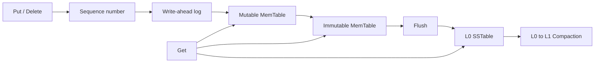

# MiniKV Storage Engine

MiniKV is a small embedded key-value storage engine written in C++17 for
Linux. Its design follows an LSM-style write path and emphasizes explicit
durability semantics, crash recovery, file lifecycle safety, and reproducible
correctness tests.

## Current status

V2 closes the single-WAL crash-recovery loop on top of the V1 write path:

- binary-safe, non-empty keys and binary-safe values;
- configurable key and value size limits;
- sequence-number-based ordering with stale per-key updates rejected;
- last-write-wins behavior for the same key;
- tombstones that prevent an older value from being exposed after deletion;
- fixed little-endian WAL encoding with an explicit format version;
- CRC32C protection for record metadata, keys, and values;
- complete-write handling for `EINTR`, short writes, and zero progress;
- strict writes that call `fdatasync` before updating the MemTable;
- explicit asynchronous writes for durability-cost experiments;
- a failed-state rule that prevents appending after a write or sync error;
- startup scanning and replay into a fresh MemTable;
- recovery of the maximum sequence number before new writes are accepted;
- exact truncation of an incomplete final record followed by `fdatasync`;
- hard failure on bad headers, checksums, or non-increasing sequences;
- transactional recovery outputs: failed replay does not expose partial state;
- retry handling for `EINTR`, short `pread`, and changing EOF;
- deterministic random testing against a `std::map` reference model;
- Golden Bytes, exhaustive tail cuts and record bit flips, injected I/O
  failures, real POSIX reopen tests, and a `SIGKILL` crash test;
- CMake builds, CTest integration, and ASan/UBSan/TSan build options.

V2 can reopen one WAL, restore its logical state, repair a torn final append,
and continue with the next sequence number. It does not yet provide file
locking, concurrent `Open`, WAL generations, Flush/SSTable recovery, or
directory synchronization for a newly created WAL. Those lifecycle guarantees
arrive with later file-publication phases, so the current code is not a
complete durable database or production-ready.

## WAL format version 1

Each record has a fixed 32-byte header followed by the key and value:

| Offset | Size | Field |
| ---: | ---: | --- |
| 0 | 4 | Magic bytes `MKVW` |
| 4 | 1 | Format version |
| 5 | 1 | Record type: value or deletion |
| 6 | 2 | Header size |
| 8 | 4 | Total record size |
| 12 | 8 | Sequence number |
| 20 | 4 | Key size |
| 24 | 4 | Value size |
| 28 | 4 | CRC32C |
| 32 | variable | Key bytes followed by value bytes |

All integers are little-endian. The checksum covers header bytes `[0, 28)`
and the complete payload, so changes to the type, sequence number, lengths,
key, or value are detected. A deletion record must have an empty value.

## Write, recovery, and durability semantics

The V1 write path performs the following steps:

```text
validate input
    -> allocate a sequence number
    -> encode and completely append one WAL record
    -> fdatasync in strict mode
    -> update the MemTable
```

Strict mode is the default. If append or `fdatasync` fails, the operation
returns an I/O error and is not made visible in the MemTable. The writer then
rejects later writes because continuing after a partial tail could turn it
into corruption in the middle of the WAL. A failed sync may still leave a
complete but unconfirmed record in the operating-system cache; its sequence
number is therefore never reused.

Asynchronous mode skips `fdatasync`. It is useful for controlled experiments,
but process or machine failure may lose recently acknowledged writes. Results
from strict and asynchronous modes must be reported separately.

On `WritePath::Open`, V2 scans from byte zero and requires sequence numbers to
be globally strictly increasing. Each complete record must have a valid header,
internally consistent lengths, and a matching CRC32C before it is replayed.
The recovered maximum sequence becomes the write path's sequence frontier.

Only an incomplete final record is repairable. Recovery truncates the file to
the last verified record boundary and calls `fdatasync` before returning
success. A malformed header, checksum mismatch, or sequence-order violation is
reported as corruption and leaves the WAL unchanged. Replay is built in a
temporary MemTable, so callers never observe a partially recovered state after
an error.

## Build and test

Requirements:

- Linux
- CMake 3.16 or newer
- a C++17 compiler such as GCC 9 or newer

```bash
cmake -S . -B build -DCMAKE_BUILD_TYPE=Debug
cmake --build build --parallel
ctest --test-dir build --output-on-failure
```

Run the memory tests with AddressSanitizer and UndefinedBehaviorSanitizer in
separate build directories:

```bash
cmake -S . -B build-asan -DCMAKE_BUILD_TYPE=Debug -DMINIKV_ENABLE_ASAN=ON
cmake --build build-asan --parallel
ctest --test-dir build-asan --output-on-failure

cmake -S . -B build-ubsan -DCMAKE_BUILD_TYPE=Debug -DMINIKV_ENABLE_UBSAN=ON
cmake --build build-ubsan --parallel
ctest --test-dir build-ubsan --output-on-failure
```

ThreadSanitizer is configured for later concurrent phases and must use its own
build directory:

```bash
cmake -S . -B build-tsan -DCMAKE_BUILD_TYPE=Debug -DMINIKV_ENABLE_TSAN=ON
cmake --build build-tsan --parallel
ctest --test-dir build-tsan --output-on-failure
```

## Planned architecture



The roadmap is incremental. A component is listed as supported only after its
implementation and tests land:

1. V0: memory semantics, sequence numbers, tombstones, and reference-model tests.
2. V1: versioned WAL encoding, complete writes, checksums, and sync policy.
3. V2: WAL replay, truncated-tail handling, corruption detection, and crash tests.
4. V3: MemTable generations and safe Flush.
5. V4: immutable SSTable format, sparse index, checksums, and point lookup.
6. V5: Manifest and atomic Version publication.
7. V6: Bloom filters and read-path statistics.
8. V7: semantics-preserving L0-to-L1 Compaction.
9. V8: background Flush, single-writer/multi-reader coordination, and clean shutdown.
10. V9: model, fault, crash, and concurrency stress testing.
11. V10: reproducible workloads, latency percentiles, amplification metrics, and one measured optimization cycle.

## Core invariants

- Every accepted record has a non-zero sequence number.
- A newer sequence number wins for the same user key.
- A tombstone remains visible to internal lookup until it is safe to discard;
  otherwise an older value could reappear.
- Storage errors and corruption must never be converted into `NotFound`.
- Future WAL files may be removed only after their records are covered by a
  safely published SSTable.
- Future Manifest versions may reference only existing, validated files.

## Scope

MiniKV is intentionally a single-node embedded engine. The initial scope does
not include SQL, network protocols, distributed consensus, replication,
transactions, MVCC, compression, encryption, or compatibility with RocksDB.
Benchmark results will characterize MiniKV itself and will not be presented as
a production-grade comparison with other databases.

## Repository layout

```text
.
├── CMakeLists.txt
├── include/minikv/
├── src/
└── tests/
```
