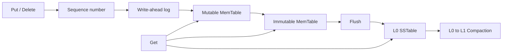

# MiniKV Storage Engine

MiniKV is a small embedded key-value storage engine written in C++17 for
Linux. Its design follows an LSM-style write path and emphasizes explicit
durability semantics, crash recovery, file lifecycle safety, and reproducible
correctness tests.

## Current status

V0 establishes the in-memory record semantics and project foundation:

- binary-safe, non-empty keys and binary-safe values;
- configurable key and value size limits;
- sequence-number-based ordering with stale per-key updates rejected;
- last-write-wins behavior for the same key;
- tombstones that prevent an older value from being exposed after deletion;
- deterministic random testing against a `std::map` reference model;
- CMake builds, CTest integration, and ASan/UBSan/TSan build options.

Persistence is not implemented in V0. The current code must not be described
as durable or production-ready.

## Build and test

Requirements:

- Linux
- CMake 3.16 or newer
- a C++17 compiler such as GCC 9 or newer

```bash
cmake -S . -B build -DCMAKE_BUILD_TYPE=Debug
cmake --build build --parallel
ctest --test-dir build --output-on-failure
```

Run the memory tests with AddressSanitizer and UndefinedBehaviorSanitizer in
separate build directories:

```bash
cmake -S . -B build-asan -DCMAKE_BUILD_TYPE=Debug -DMINIKV_ENABLE_ASAN=ON
cmake --build build-asan --parallel
ctest --test-dir build-asan --output-on-failure

cmake -S . -B build-ubsan -DCMAKE_BUILD_TYPE=Debug -DMINIKV_ENABLE_UBSAN=ON
cmake --build build-ubsan --parallel
ctest --test-dir build-ubsan --output-on-failure
```

ThreadSanitizer is configured for later concurrent phases and must use its own
build directory:

```bash
cmake -S . -B build-tsan -DCMAKE_BUILD_TYPE=Debug -DMINIKV_ENABLE_TSAN=ON
cmake --build build-tsan --parallel
ctest --test-dir build-tsan --output-on-failure
```

## Planned architecture



The roadmap is incremental. A component is listed as supported only after its
implementation and tests land:

1. V0: memory semantics, sequence numbers, tombstones, and reference-model tests.
2. V1: versioned WAL encoding, complete writes, checksums, and sync policy.
3. V2: WAL replay, truncated-tail handling, corruption detection, and crash tests.
4. V3: MemTable generations and safe Flush.
5. V4: immutable SSTable format, sparse index, checksums, and point lookup.
6. V5: Manifest and atomic Version publication.
7. V6: Bloom filters and read-path statistics.
8. V7: semantics-preserving L0-to-L1 Compaction.
9. V8: background Flush, single-writer/multi-reader coordination, and clean shutdown.
10. V9: model, fault, crash, and concurrency stress testing.
11. V10: reproducible workloads, latency percentiles, amplification metrics, and one measured optimization cycle.

## Core invariants

- Every accepted record has a non-zero sequence number.
- A newer sequence number wins for the same user key.
- A tombstone remains visible to internal lookup until it is safe to discard;
  otherwise an older value could reappear.
- Storage errors and corruption must never be converted into `NotFound`.
- Future WAL files may be removed only after their records are covered by a
  safely published SSTable.
- Future Manifest versions may reference only existing, validated files.

## Scope

MiniKV is intentionally a single-node embedded engine. The initial scope does
not include SQL, network protocols, distributed consensus, replication,
transactions, MVCC, compression, encryption, or compatibility with RocksDB.
Benchmark results will characterize MiniKV itself and will not be presented as
a production-grade comparison with other databases.

## Repository layout

```text
.
├── CMakeLists.txt
├── include/minikv/
├── src/
└── tests/
```
